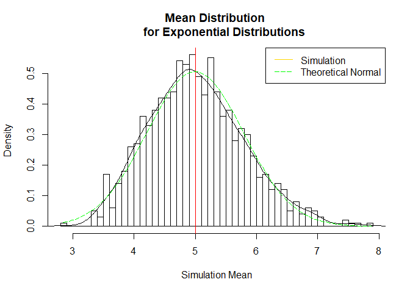
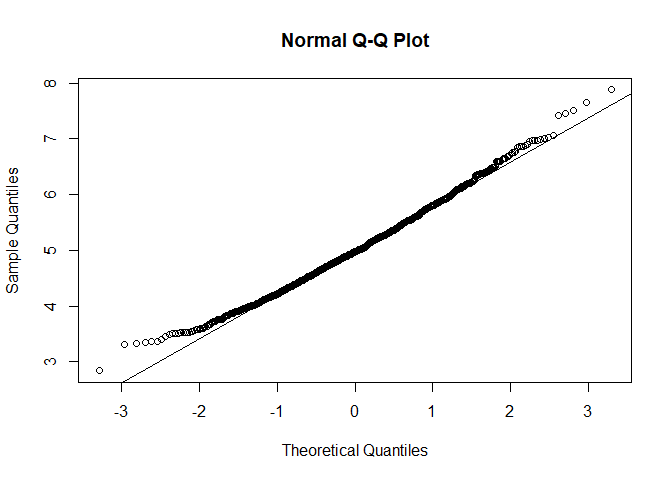

Part 1: Simulation Exercise
================
Written By: Javier Ng

Overview
--------

In this report, I investigate the mean distribution of 40 exponentials and compare it with the Central Limit Theorem (CLT). Through 1000 simulations, I compared the mean, variance, and distribution of averages of 40 exponentials to the normal distribution.

Simulations Criteria
--------------------

As part of the assignment, the exponential distribution can be simulated with `rexp(n, lambda)` where lambda is the rate parameter. The mean of exponential distribution is `1/lambda` and the standard deviation is also `1/lambda`. In this analysis, I set `lambda` = 0.2 for all simulations.

I used the following codes to do the 1000 simulations. In this code, I have fixed the `seed` of the simulation, `lambda`, number of simulations, and sample size. I then use the `rexp` to run the simulations and finally, find the averages for the 40 exponentials.

``` r
set.seed(2018)
lambda <- 0.2
num_sim <- 1000
sample_size <- 40
simulation <- matrix(rexp(num_sim * sample_size, rate = lambda), num_sim, sample_size)
means <- rowMeans(simulation)
```

Distribution
------------

In this section, the distribution of the sample means is shown. This will allow me to address the questions regarding the differences between the simulation distribution and theoretical normal distribution.

``` r
hist(means, breaks = 50, prob = TRUE, main = "Mean Distribution 
     for Exponential Distributions", xlab = "Simulation Mean")
lines(density(means))
abline(v = 1/lambda, col = "red")
x_fit <- seq(min(means), max(means), length = 100)
y_fit <- dnorm(x_fit, mean = 1/lambda, sd = (1/lambda/sqrt(sample_size)))
lines(x_fit, y_fit, pch = 50, col = "green", lty = 5)
legend('topright', c("Simulation", "Theoretical Normal"), 
       lty = c(1,5), col = c("gold", "green"))
```



### Sample Mean vs. Theoretical Mean

The mean for the theoretical normal distribution is 5 while the simulation distribution is centered at 5.0201. We can conclude that the means of two distributions are very close to each other.

``` r
simul_mean <- mean(means)
simul_mean
```

    ## [1] 5.020107

``` r
theo_mean <- 1 / lambda
theo_mean
```

    ## [1] 5

### Sample Variance vs. Theoretical Variance

The variance for the theoretical normal distribution is 0.625 while the variance of the simulation is 0.6063082. We can conclude that the variances of two distributions are also very close to each other.

``` r
simul_var <- var(means)
simul_var
```

    ## [1] 0.6063082

``` r
theo_var <- (1/lambda)^2/sample_size
theo_var
```

    ## [1] 0.625

### Sample Distribution vs. Theoretical Distribution

The comparison of the sample distribution with the theoretical normal distribution will be done in 3 ways.

First, we visually compare the graph of the distributions. We can see that the *distribution of sample means* (the histogram) closely matches a *theoretical normal distribution*.

Second, we need to compare the `mean`, `variance`, and `confidence intervals` between two distributions. In the above sections titled "Sample Mean vs. Theoretical Mean"" and "Sample Variance vs. Theoretical Variance"", we compared the `mean` and `variance` and showed that they closely match. Now, the confidence intervals:

``` r
simul_interval <- round(mean(means) + c(-1,1)*1.96*sd(means)/sqrt(sample_size),3)
simul_interval
```

    ## [1] 4.779 5.261

``` r
theo_interval <- theo_mean + c(-1,1)*1.96*sqrt(theo_var)/sqrt(sample_size)
theo_interval
```

    ## [1] 4.755 5.245

The 95% confidence interval for the simulation is (4.779, 5.261) while the theoretical 95% confidence interval is (4.755, 5.245). We can conclude that the confidence intervals also closely match each other.

Third, we look at the QQ plot.

``` r
qqnorm(means)
qqline(means)
```



The QQ plot shows that the simulation quartiles are closely similar to the theoretical normal quartiles.

Conclusion
----------

The 3 tests showed that the distribution of the simulation results is approximately normal.
