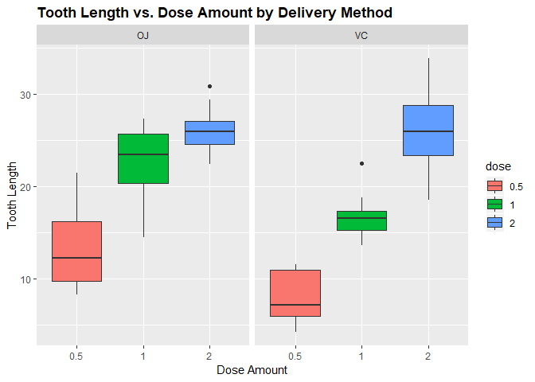
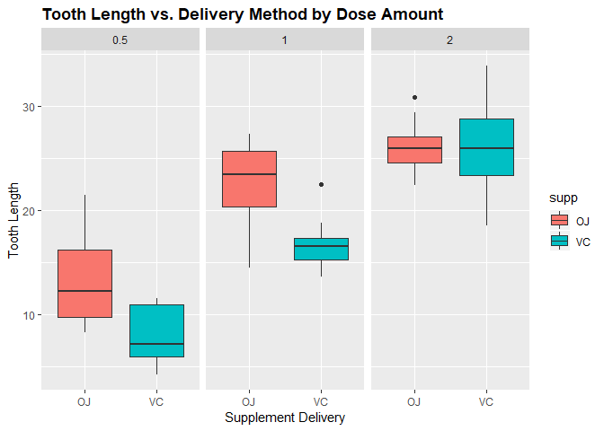

Statistical Inference Part 2
================
Written by: Javier Ng

Introduction
------------

This report aims to analyze the ToothGrowth data in the R datasets package. I'll be doing my analysis in the order listed below.

-   Load the ToothGrowth data and perform some basic exploratory data analyses
-   Provide a basic summary of the data.
-   Use confidence intervals and/or hypothesis tests to compare tooth growth by supp and dose (only use the techniques from class, even if there's other approaches worth considering).
-   State your conclusions and the assumptions needed for your conclusions.

Loading of Data Set & Libraries
-------------------------------

``` r
#loading required libraries
library(ggplot2)

#loading of dataset
data("ToothGrowth")

#display summary of data
summary(ToothGrowth)
```

    ##       len        supp         dose      
    ##  Min.   : 4.20   OJ:30   Min.   :0.500  
    ##  1st Qu.:13.07   VC:30   1st Qu.:0.500  
    ##  Median :19.25           Median :1.000  
    ##  Mean   :18.81           Mean   :1.167  
    ##  3rd Qu.:25.27           3rd Qu.:2.000  
    ##  Max.   :33.90           Max.   :2.000

``` r
#display structure of data
str(ToothGrowth)
```

    ## 'data.frame':    60 obs. of  3 variables:
    ##  $ len : num  4.2 11.5 7.3 5.8 6.4 10 11.2 11.2 5.2 7 ...
    ##  $ supp: Factor w/ 2 levels "OJ","VC": 2 2 2 2 2 2 2 2 2 2 ...
    ##  $ dose: num  0.5 0.5 0.5 0.5 0.5 0.5 0.5 0.5 0.5 0.5 ...

``` r
#disply first 5 rows of data
head(ToothGrowth)
```

    ##    len supp dose
    ## 1  4.2   VC  0.5
    ## 2 11.5   VC  0.5
    ## 3  7.3   VC  0.5
    ## 4  5.8   VC  0.5
    ## 5  6.4   VC  0.5
    ## 6 10.0   VC  0.5

Exploratory Data Analysis
-------------------------

``` r
# Convert dose to a factor
ToothGrowth$dose<-as.factor(ToothGrowth$dose)

# Plot tooth length ('len') vs. the dose amount ('dose'), broken out by supplement delivery method ('supp')
ggplot(aes(x=dose, y=len), data=ToothGrowth) + geom_boxplot(aes(fill=dose)) + xlab("Dose Amount") + ylab("Tooth Length") + facet_grid(~ supp) + ggtitle("Tooth Length vs. Dose Amount by Delivery Method") + 
     theme(plot.title = element_text(lineheight=.8, face="bold"))
```



``` r
# Plot tooth length ('len') vs. supplement delivery method ('supp') broken out by the dose amount ('dose')
ggplot(aes(x=supp, y=len), data=ToothGrowth) + geom_boxplot(aes(fill=supp)) + xlab("Supplement Delivery") + ylab("Tooth Length") + facet_grid(~ dose) + ggtitle("Tooth Length vs. Delivery Method by Dose Amount") + 
     theme(plot.title = element_text(lineheight=.8, face="bold"))
```



Statistical Testing
-------------------

Using T-test to compare tooth growth by supplement

``` r
# execute t-test
t.test(len~supp,data=ToothGrowth)
```

    ## 
    ##  Welch Two Sample t-test
    ## 
    ## data:  len by supp
    ## t = 1.9153, df = 55.309, p-value = 0.06063
    ## alternative hypothesis: true difference in means is not equal to 0
    ## 95 percent confidence interval:
    ##  -0.1710156  7.5710156
    ## sample estimates:
    ## mean in group OJ mean in group VC 
    ##         20.66333         16.96333

The p-value of this test was 0.06. Since the p-value is greater than 0.05 and the confidence interval of the test contains zero we can say that supplement types seems to have no impact on Tooth growth based on this test.

Now we’ll compare tooth growth by dose, looking at the different pairs of dose values.

``` r
# run t-test using dose amounts 0.5 and 1.0
ToothGrowth_sub <- subset(ToothGrowth, ToothGrowth$dose %in% c(1.0,0.5))
t.test(len~dose,data=ToothGrowth_sub)
```

    ## 
    ##  Welch Two Sample t-test
    ## 
    ## data:  len by dose
    ## t = -6.4766, df = 37.986, p-value = 1.268e-07
    ## alternative hypothesis: true difference in means is not equal to 0
    ## 95 percent confidence interval:
    ##  -11.983781  -6.276219
    ## sample estimates:
    ## mean in group 0.5   mean in group 1 
    ##            10.605            19.735

``` r
# run t-test using dose amounts 0.5 and 2.0
ToothGrowth_sub <- subset(ToothGrowth, ToothGrowth$dose %in% c(0.5,2.0))
t.test(len~dose,data=ToothGrowth_sub)
```

    ## 
    ##  Welch Two Sample t-test
    ## 
    ## data:  len by dose
    ## t = -11.799, df = 36.883, p-value = 4.398e-14
    ## alternative hypothesis: true difference in means is not equal to 0
    ## 95 percent confidence interval:
    ##  -18.15617 -12.83383
    ## sample estimates:
    ## mean in group 0.5   mean in group 2 
    ##            10.605            26.100

``` r
# run t-test using dose amounts 1.0 and 2.0
ToothGrowth_sub <- subset(ToothGrowth, ToothGrowth$dose %in% c(1.0,2.0))
t.test(len~dose,data=ToothGrowth_sub)
```

    ## 
    ##  Welch Two Sample t-test
    ## 
    ## data:  len by dose
    ## t = -4.9005, df = 37.101, p-value = 1.906e-05
    ## alternative hypothesis: true difference in means is not equal to 0
    ## 95 percent confidence interval:
    ##  -8.996481 -3.733519
    ## sample estimates:
    ## mean in group 1 mean in group 2 
    ##          19.735          26.100

As can be seen, the p-value of each test was essentially zero and the confidence interval of each test does not cross over zero (0).

Based on this result we can assume that the average tooth length increases with an inceasing dose, and therefore the null hypothesis can be rejected.

Conclusion
----------

Given the following assumptions:

-   The sample is representative of the population
-   The distribution of the sample means follows the Central Limit Theorem

In reviewing our t-test analysis from above, we can conclude that supplement delivery method has no effect on tooth growth/length, however increased dosages do result in increased tooth length.
